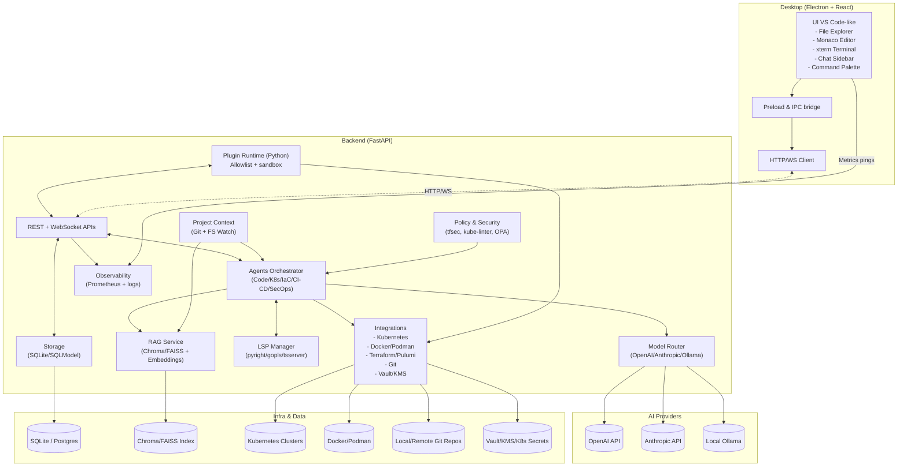
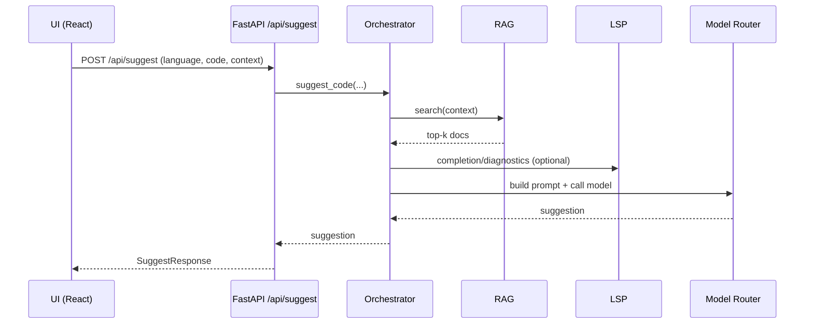
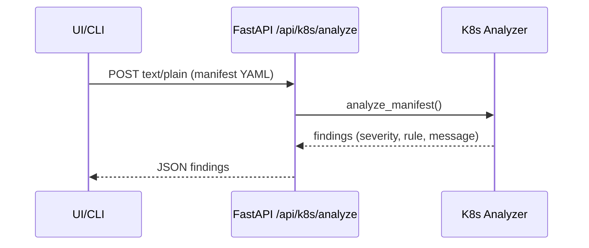
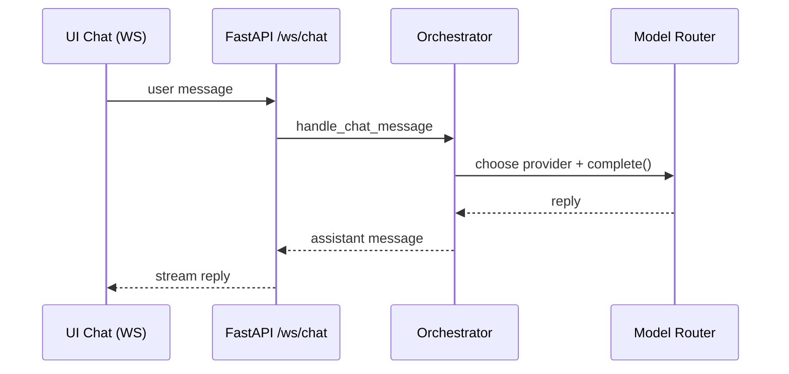

### Kiến trúc hoạt động chi tiết

Tài liệu này mô tả cấu trúc hệ thống, các thành phần chính, luồng xử lý và các tham số triển khai của dự án Cursor DevOps AI (Desktop).

#### Tổng quan
- Frontend Electron (React + Monaco + xterm) giao tiếp với Backend FastAPI bằng HTTP/WS.
- Backend điều phối DevOps Agents, tích hợp K8s/Docker/Terraform/Git, sử dụng Model Router (OpenAI/Anthropic/Ollama) và RAG.
- Lưu trữ hội thoại, metadata trong SQLite (SQLModel); đo đạc Prometheus.

#### Sơ đồ tổng thể

#### Luồng xử lý chính

1) Suggest code (REST)

2) Phân tích Kubernetes manifest (REST)

3) Chat (WebSocket)

#### Bảo mật & Policy
- Secrets dùng env/Vault/KMS; không commit vào repo.
- K8s: khuyến nghị tránh `:latest`, yêu cầu `requests/limits`, `runAsNonRoot=true`, `allowPrivilegeEscalation=false`, `drop: [ALL]`.
- IaC: tfsec; Policy OPA/conftest; CI/CD scan dependencies.

#### Quan sát & logging
- `/metrics` cho Prometheus (HTTP counters, WS counters, LLM latency/tokens có thể mở rộng).
- Structured logs; có thể thêm OpenTelemetry.

#### Tham số môi trường
- `PROVIDER`: `openai|anthropic|ollama|none`
- `OPENAI_MODEL`, `ANTHROPIC_MODEL`, `OLLAMA_MODEL`, `OLLAMA_HOST`
- `ENABLED_PLUGINS`: danh sách module plugin cho phép nạp.

#### Ports
- Backend: 8000 (HTTP/WS)
- Frontend (Vite dev): 5173
- Prometheus metrics: `/metrics`

#### Lộ trình phát triển
- Streaming WS cho chat/suggest; tích hợp đầy đủ LSP; CI/CD templates (GA/Jenkins/GitLab/ArgoCD); policy scan (tfsec/kube-linter/trivy/OPA); packaging Electron.

