### Kiến trúc hoạt động chi tiết

Tài liệu này mô tả cấu trúc hệ thống, các thành phần chính, luồng xử lý và các tham số triển khai của dự án Cursor DevOps AI (Desktop).

#### Tổng quan
- Frontend Electron (React + Monaco + xterm) giao tiếp với Backend FastAPI bằng HTTP/WS.
- Backend điều phối DevOps Agents, tích hợp K8s/Docker/Terraform/Git, sử dụng Model Router (OpenAI/Anthropic/Ollama) và RAG.
- Lưu trữ hội thoại, metadata trong SQLite (SQLModel); đo đạc Prometheus.

#### Sơ đồ tổng thể

#### Luồng xử lý chính

1) Suggest code (REST)

2) Phân tích Kubernetes manifest (REST)

3) Chat (WebSocket)

#### Bảo mật & Policy
- Secrets dùng env/Vault/KMS; không commit vào repo.
- K8s: khuyến nghị tránh `:latest`, yêu cầu `requests/limits`, `runAsNonRoot=true`, `allowPrivilegeEscalation=false`, `drop: [ALL]`.
- IaC: tfsec; Policy OPA/conftest; CI/CD scan dependencies.

#### Quan sát & logging
- `/metrics` cho Prometheus (HTTP counters, WS counters, LLM latency/tokens có thể mở rộng).
- Structured logs; có thể thêm OpenTelemetry.

#### Tham số môi trường
- `PROVIDER`: `openai|anthropic|ollama|none`
- `OPENAI_MODEL`, `ANTHROPIC_MODEL`, `OLLAMA_MODEL`, `OLLAMA_HOST`
- `ENABLED_PLUGINS`: danh sách module plugin cho phép nạp.

#### Ports
- Backend: 8000 (HTTP/WS)
- Frontend (Vite dev): 5173
- Prometheus metrics: `/metrics`

#### Lộ trình phát triển
- Streaming WS cho chat/suggest; tích hợp đầy đủ LSP; CI/CD templates (GA/Jenkins/GitLab/ArgoCD); policy scan (tfsec/kube-linter/trivy/OPA); packaging Electron.

---

### CI/CD pipelines và gates bảo mật

#### Mô hình pipeline nhiều giai đoạn
- Build → Test → Security Scan → Package → Deploy (Dev → Staging → Prod) với approval gates.
- Tích hợp SAST/DAST, dependency scan, container image scan (trivy), IaC/K8s scan (tfsec/kube-linter/OPA).

#### Một số job/gate điển hình
- SAST: semgrep/codeql
- Dependency scan: npm audit / pip-audit / osv-scanner
- Container scan: trivy image
- IaC scan: tfsec (Terraform), checkov (tuỳ chọn)
- K8s scan: kube-linter, conftest/OPA cho policy

---

### One-click Deployment workflow

Ghi chú:
- Có thể thêm canary/blue-green và auto-rollback khi liveness/readiness fail hoặc SLO xấu.

---

### Drift Detection workflow (IaC)

```mermaid
sequenceDiagram
  participant SCH as Scheduler (cron)
  participant API as FastAPI /api/drift/check (tương lai)
  participant ORC as Orchestrator
  participant TF as Terraform State
  participant CSP as Cloud APIs

  SCH->>API: trigger drift check
  API->>ORC: compare desired vs actual
  ORC->>TF: load desired state (plan)
  ORC->>CSP: fetch live resources
  ORC-->>API: drift report (added/changed/removed)
  API-->>SCH: result
```

T tuỳ chọn: tự động reconcile với approval trước khi apply.

---

### Runbook generation & execution

---

### Tuân thủ & dữ liệu
- Compliance: SOC2/PCI-DSS/GDPR – bật audit logging, retention, RBAC chặt chẽ, mã hoá in-transit/at-rest.
- Data retention: cấu hình thời gian lưu hội thoại và logs; hỗ trợ export/anonymize.

### Chi phí & tối ưu hiệu năng
- Ưu tiên Ollama offline khi phù hợp để giảm chi phí API.
- Cache ngữ cảnh dự án, index RAG theo incremental.
- Giới hạn token/temperature theo loại tác vụ DevOps.

