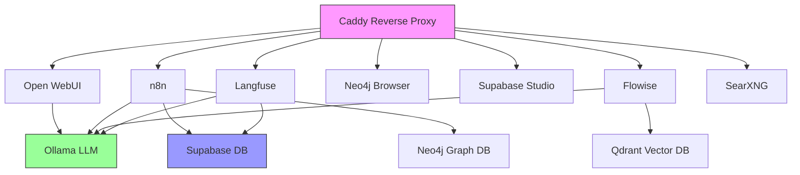

# Local AI Packaged - Architecture Overview

## 🏗️ System Architecture

The Local AI Packaged system follows a microservices architecture pattern, where each AI service runs as an independent container while maintaining seamless integration through shared networks and standardized APIs.

## 📊 High-Level Architecture

```
┌─────────────────────────────────────────────────────────────────┐
│                        Load Balancer (Caddy)                      │
│                    ┌─────────────────────┐                      │
│                    │   Reverse Proxy     │                      │
│                    │   HTTPS/TLS         │                      │
│                    └──────────┬──────────┘                      │
└───────────────────────────────┼─────────────────────────────────┘
                                │
                    ┌───────────┴───────────┐
                    │   Internal Network    │
                    │   (ai-network)        │
                    └─┬─┬─┬─┬─┬─┬─┬─┬─┬─┬─┘
      ┌─────────────────┘ │ │ │ │ │ │ │ │ │ └─────────────────┐
      │                   │ │ │ │ │ │ │ │ │                   │
┌─────┴─────┐ ┌─────┴───┐ │ │ │ │ │ │ │ │ │ ┌─────┴─────┐ ┌─┴───────┐
│  Ollama   │ │Open WebUI│ │ │ │ │ │ │ │ │ │ │   n8n     │ │ Flowise │
│  (LLM)    │ │ (Chat)   │ │ │ │ │ │ │ │ │ │ │(Workflow) │ │(Agents) │
└───────────┘ └─────────┘ │ │ │ │ │ │ │ │ │ └───────────┘ └─────────┘
                          │ │ │ │ │ │ │ │ │
┌───────────┐ ┌─────────┐ │ │ │ │ │ │ │ │ │ ┌───────────┐ ┌─────────┐
│Supabase   │ │Neo4j    │ │ │ │ │ │ │ │ │ │ │ Qdrant    │ │SearXNG  │
│(Database) │ │(Graph)  │ │ │ │ │ │ │ │ │ │ │(Vector)   │ │(Search) │
└───────────┘ └─────────┘ │ │ │ │ │ │ │ │ │ └───────────┘ └─────────┘
                          │ │ │ │ │ │ │ │ │
                    ┌─────┴─┴─┴─┴─┴─┴─┴─┴─┴─────┐
                    │     Langfuse (Observability)   │
                    │     Monitoring & Analytics     │
                    └───────────────────────────────┘
```

## 🔗 Service Integration Map

### Data Flow Architecture

```
User Input → Caddy → Service → Processing → Storage → Response
     ↓         ↓        ↓         ↓          ↓         ↓
  Browser   Proxy   Business   Compute    Database   Browser
            (TLS)    Logic      Engine    (Vector)   Display
```

### Service Dependencies



## 🏛️ Service Layers

### 1. **Access Layer**
- **Caddy**: Handles all incoming requests, SSL termination, and load balancing
- **Ports**: 80 (HTTP), 443 (HTTPS)
- **Features**: Automatic HTTPS, rate limiting, security headers

### 2. **Presentation Layer**
- **Open WebUI**: User-facing chat interface
- **n8n**: Workflow management UI
- **Flowise**: AI agent builder interface
- **Supabase Studio**: Database management interface

### 3. **Business Logic Layer**
- **n8n**: Workflow automation engine
- **Flowise**: AI agent orchestration
- **Langfuse**: LLM observability and monitoring

### 4. **AI Processing Layer**
- **Ollama**: Local LLM inference
- **Vector Operations**: Qdrant for embeddings
- **Graph Processing**: Neo4j for knowledge graphs

### 5. **Data Persistence Layer**
- **Supabase**: Primary PostgreSQL database
- **Qdrant**: Vector embeddings storage
- **Neo4j**: Graph data storage
- **Volumes**: Persistent Docker volumes

## 🔐 Security Architecture

### Network Security
- **Isolated Network**: All services communicate through `ai-network`
- **Internal Communication**: Services use container names for DNS resolution
- **Port Exposure**: Only essential ports exposed to host

### Authentication & Authorization
- **Service-level Auth**: Each service has its own authentication
- **API Keys**: Secure API key management
- **JWT Tokens**: Stateless authentication for APIs

### Data Security
- **Volume Encryption**: Docker volumes for data persistence
- **Environment Variables**: Secrets management through .env
- **TLS/SSL**: All external communication encrypted

## 📊 Scalability Design

### Horizontal Scaling
- **Load Balancing**: Caddy distributes traffic
- **Service Independence**: Each service can be scaled independently
- **Stateless Services**: Most services are stateless and scalable

### Resource Management
- **Memory Limits**: Configurable per service
- **CPU Limits**: GPU acceleration where applicable
- **Storage**: Persistent volumes with cleanup policies

## 🔄 Data Flow Patterns

### 1. **Chat Flow**
```
User → Open WebUI → Ollama → Response
                ↓
            Langfuse (Logging)
```

### 2. **Workflow Flow**
```
Trigger → n8n → [Multiple Services] → Action
                ↓
            Supabase (State)
            Langfuse (Monitoring)
```

### 3. **RAG Flow**
```
Query → Embedding → Qdrant Search → Context → LLM → Response
```

### 4. **Knowledge Graph Flow**
```
Data → Neo4j → Graph Queries → Insights → LLM → Enhanced Response
```

## 🛠️ Configuration Architecture

### Environment Variables
- **Centralized**: All configuration in .env file
- **Service-specific**: Each service has dedicated config
- **Secrets Management**: Secure handling of API keys

### Service Discovery
- **Docker DNS**: Automatic service discovery
- **Health Checks**: Automated service health monitoring
- **Restart Policies**: Automatic recovery from failures

## 📈 Monitoring Architecture

### Health Monitoring
- **Container Health**: Docker health checks
- **Service Health**: Individual service health endpoints
- **Resource Monitoring**: CPU, memory, disk usage

### Performance Monitoring
- **Langfuse**: LLM performance tracking
- **Custom Metrics**: Application-specific metrics
- **Log Aggregation**: Centralized logging

## 🔍 Troubleshooting Architecture

### Debug Mode
- **Verbose Logging**: Detailed logs for troubleshooting
- **Service Isolation**: Individual service startup/shutdown
- **Health Checks**: Automated diagnostic tools

### Recovery Procedures
- **Backup Strategy**: Automated volume backups
- **Rollback Plan**: Service version management
- **Disaster Recovery**: Data restoration procedures

## 🚀 Deployment Strategies

### Development
- **Local Development**: Full stack on single machine
- **Resource Requirements**: 8GB RAM, 4 CPU cores
- **Quick Setup**: Single command startup

### Production
- **High Availability**: Multiple instances
- **Load Balancing**: Distributed traffic
- **Monitoring**: Comprehensive observability
- **Security**: Hardened configuration

## 🌐 Network Architecture Details

### Internal Network (`ai-network`)
- **Driver**: Bridge
- **Subnet**: 172.20.0.0/16
- **Gateway**: 172.20.0.1
- **DNS**: Automatic Docker DNS

### Service Communication
- **Service Names**: Used as DNS hostnames
- **Port Mapping**: Internal ports vs external exposure
- **Protocol**: HTTP/HTTPS for APIs, TCP for databases

## 📊 Performance Characteristics

### Resource Usage (Typical)
- **Ollama**: 4-8GB RAM (model dependent)
- **Supabase**: 1-2GB RAM
- **Neo4j**: 1-2GB RAM
- **Other Services**: 512MB-1GB RAM each

### Bottlenecks
- **GPU Memory**: LLM model size limitations
- **Disk I/O**: Vector database operations
- **Network**: Inter-service communication

### Optimization Strategies
- **Model Quantization**: Reduce memory usage
- **Caching**: Implement intelligent caching
- **Connection Pooling**: Database connection optimization

This architecture provides a robust, scalable foundation for local AI development while maintaining security and performance standards.